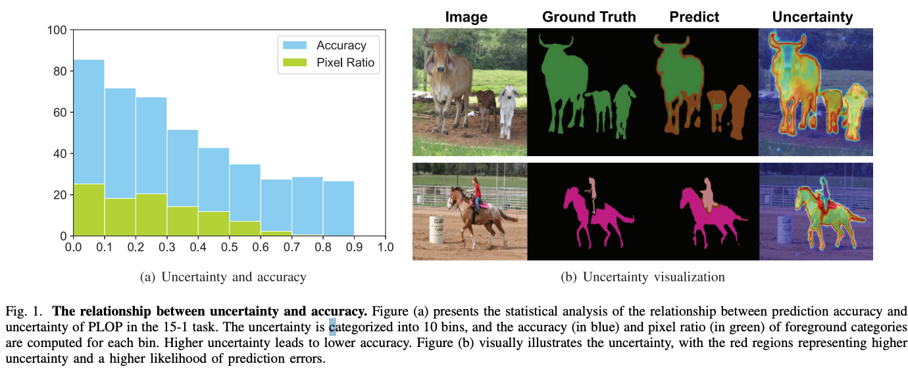
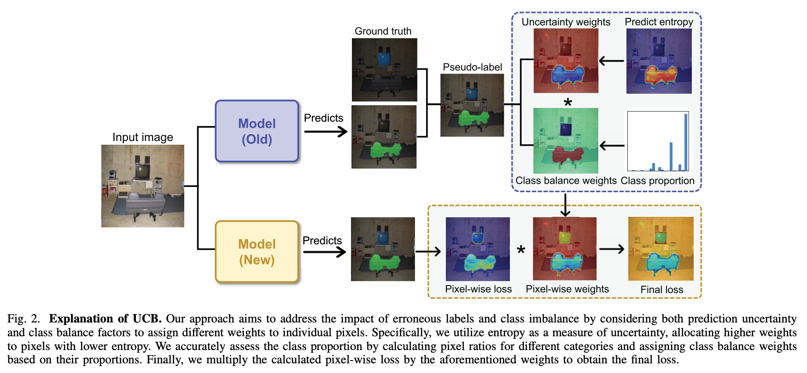

# UCB: Enhancing Continual Semantic Segmentation via Uncertainty and Class Balance Re-weighting

\
🔗 Official Implementation of TIP 2025 Paper:\
**"[Enhancing Continual Semantic Segmentation via Uncertainty and Class Balance Re-weighting](https://ieeexplore.ieee.org/document/11030217)"**

## 🔍 Introduction

Continual Semantic Segmentation (CSS) aims to continuously learn new semantic categories **without forgetting** previously learned knowledge. In real-world scenarios, new training data often lacks annotations for old categories, making **pseudo-labeling** necessary. However, low-quality pseudo-labels can lead to **catastrophic forgetting**.

Moreover, **class imbalance**, especially between old and new classes, severely affects performance.

To tackle these challenges, we propose **UCB (Uncertainty and Class Balance Re-weighting)**:

- 🔹 Assigns **higher weights** to low-uncertainty pseudo-labeled pixels
- 🔹 Dynamically balances **underrepresented classes**
- 🔹 Simple yet effective, **plug-and-play** module compatible with popular CSS baselines

📌 Applicable to any method using pseudo-labels.\
📊 Validated on **PASCAL VOC** and **ADE20K** using **PLOP**, **SSUL**, and **CoinSeg** frameworks.




---

## 📁 Dataset Preparation

> Please follow the dataset preparation guidelines:
> ```bash
> bash UCB_PLOP/data/download_voc.sh
> bash UCB_PLOP/data/download_ade.sh
> ```

### Recommended Directory Structure

```bash
data/
  VOC2012/
    ├── Annotations/
    ├── ImageSet/
    ├── JPEGImages/
    ├── SegmentationClassAug/
    ├── saliency_map/
    ├── proposal100/
  ADEChallengeData2016/
    ├── annotations/
        ├── training/
        ├── validation/
    ├── images/
        ├── training/
        ├── validation/
    ├── proposal_adetrain/
    ├── proposal_adeval/
```

### Additional Data for SSUL

- [SegmentationClassAug.zip](https://github.com/clovaai/SSUL/releases/download/preparation/SegmentationClassAug.zip)
- [saliency_map.zip](https://github.com/clovaai/SSUL/releases/download/preparation/saliency_map.zip)

### Additional Data for CoinSeg

- [proposal100](https://drive.google.com/file/d/1FxoyVa0I1IEwtW2ykGlNf-JkOYkK80E6/view?usp=sharing)
- [proposal_adetrain](https://drive.google.com/file/d/1kWfPNhoUnYz0uPuHJUALxiqvVqlCKrwW/view?usp=sharing)
- [proposal_adeval](https://drive.google.com/file/d/16xNMO4siqJXr5A03ywQDXU0F1Ld5OFtw/view?usp=sharing)

---

## ⚙️ Environment Setup

Please refer to:

- PLOP: [https://github.com/arthurdouillard/CVPR2021_PLOP](https://github.com/arthurdouillard/CVPR2021_PLOP)
- SSUL: [https://github.com/clovaai/SSUL](https://github.com/clovaai/SSUL)
- CoinSeg: [https://github.com/zkzhang98/CoinSeg](https://github.com/zkzhang98/CoinSeg)

---

## 🏁 Training Commands

### 📌 PLOP + UCB

```bash
cd UCB_PLOP
bash scripts_entropy/voc/plop_15-1.sh
```

### 📌 SSUL + UCB

```bash
cd UCB-SSUL
bash scripts/run-15-1.sh
```

### 📌 CoinSeg + UCB

```bash
cd UCB-CoinSeg
bash scripts/run-15-1.sh
```

---

## 🔌 Plug-and-Play Module Guide

You can easily integrate the UCB module into any pseudo-label based CSS method:

```python
from entropy import EntropyWeights

# Initialize weighting module
entropy_weights = EntropyWeights(total_classes, old_classes)

# Compute weights
weight = entropy_weights.get_weight(pseudo_labels, outputs_prev)

# Apply weights to loss
loss = criterion(outputs, pseudo_labels)  # set reduction=None
loss = loss * weight
loss = loss.mean()
```

---

## 🇨🇳 Jittor Release
See UCB_jittor
---

## 🔓 License

This code is licensed under the **Creative Commons Attribution-NonCommercial 4.0 International**.\
📄 [Read the full license](https://creativecommons.org/licenses/by-nc/4.0/)

> ❗**Note:** This code is for **non-commercial research use only**. For commercial use, please contact the authors.

---

## 📬 Contact

If you have any questions or need help, feel free to reach out:

📧 [liangzichen1009@163.com](mailto:liangzichen1009@163.com)

---

## 🙏 Acknowledgements

This work builds upon the open-source implementations of:

- [PLOP (CVPR 2021)](https://github.com/arthurdouillard/CVPR2021_PLOP)
- [SSUL (NeurIPS 2021)](https://github.com/clovaai/SSUL)
- [CoinSeg (ICCV 2023)](https://github.com/zkzhang98/CoinSeg)

We sincerely thank the authors for their valuable contributions to the community.

